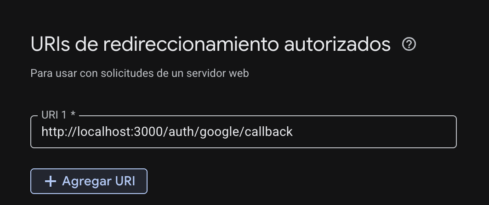

# nest-google-api

NestJS 11 + TypeORM + PostgreSQL con autenticación Google OAuth2 y JWT.

## Requisitos

- Docker y Docker Compose

## Levantar en local

### 1. Copiar variables de entorno

```bash
cp .env.example .env
```

Editar `.env` y completar las variables requeridas:

| Variable | Descripción |
|---|---|
| `NODE_ENV` | Entorno (`development`) |
| `PORT` | Puerto en el que escucha la app (ej. `3000`) |
| `DB_HOST` | Host de PostgreSQL (usar `localhost` fuera de Docker) |
| `DB_PORT` | Puerto de PostgreSQL (ej. `5432`) |
| `DB_USER` | Usuario de la base de datos |
| `DB_PASSWORD` | Contraseña de la base de datos |
| `DB_NAME` | Nombre de la base de datos |
| `JWT_SECRET` | Clave secreta para firmar los JWT |
| `JWT_EXPIRES_IN` | Expiración del token (ej. `7d`) |
| `GOOGLE_CLIENT_ID` | Client ID de Google OAuth2 |
| `GOOGLE_CLIENT_SECRET` | Client Secret de Google OAuth2 |
| `GOOGLE_CALLBACK_URL` | URL de callback — debe coincidir con la registrada en Google Cloud Console |

En Google Cloud Console, dentro de **Credenciales → OAuth 2.0 → URIs de redireccionamiento autorizados**, agrega la URL del callback:


| `FRONTEND_URL` | URL del frontend al que redirigir tras login (ej. `http://localhost:4200`) |
| `DEV_AUTH_ENABLED` | Habilita login de desarrollo sin Google (`true` / `false`) |
| `DEV_AUTH_EMAIL` | Email del usuario de desarrollo |
| `DEV_AUTH_PASSWORD` | Contraseña del usuario de desarrollo |
| `DEV_AUTH_NAME` | Nombre del usuario de desarrollo |

### 2. Levantar los servicios

```bash
docker compose up
```

Esto inicia PostgreSQL, la app NestJS con hot-reload y Adminer (cliente web de base de datos).

| Servicio | URL |
|---|---|
| API | `http://localhost:3000` |
| Swagger | `http://localhost:3000/api/docs` |
| Adminer | `http://localhost:8080` |

Para correr en segundo plano:

```bash
docker compose up -d
```

### 3. Ver logs

```bash
docker compose logs -f app
```

### 4. Detener

```bash
docker compose down
```

Para eliminar también el volumen de la base de datos:

```bash
docker compose down -v
```

## Cliente de base de datos (Adminer)

Adminer es una interfaz web para explorar y consultar la base de datos PostgreSQL.

Accede en `http://localhost:8080` y usa estos datos de conexión:

| Campo | Valor |
|---|---|
| Sistema | `PostgreSQL` |
| Servidor | `postgres` |
| Usuario | valor de `DB_USER` en `.env` |
| Contraseña | valor de `DB_PASSWORD` en `.env` |
| Base de datos | valor de `DB_NAME` en `.env` |

> El campo **Servidor** debe ser `postgres` (nombre del servicio Docker), no `localhost`.

## Endpoints de autenticación

| Método | Ruta | Descripción |
|---|---|---|
| `GET` | `/auth/google` | Inicia el flujo OAuth con Google |
| `GET` | `/auth/google/callback` | Callback de Google, redirige al frontend con el JWT |
| `GET` | `/auth/me` | Devuelve el usuario autenticado (requiere `Authorization: Bearer <token>`) |
| `GET` | `/auth/logout` | Cierra sesión (stateless) |
| `POST` | `/auth/dev-login` | Login de desarrollo (solo si `DEV_AUTH_ENABLED=true`) |
| `GET` | `/auth/dev-credentials` | Credenciales de desarrollo (solo si `DEV_AUTH_ENABLED=true`) |

## Tests

```bash
docker compose exec app npm test
```
